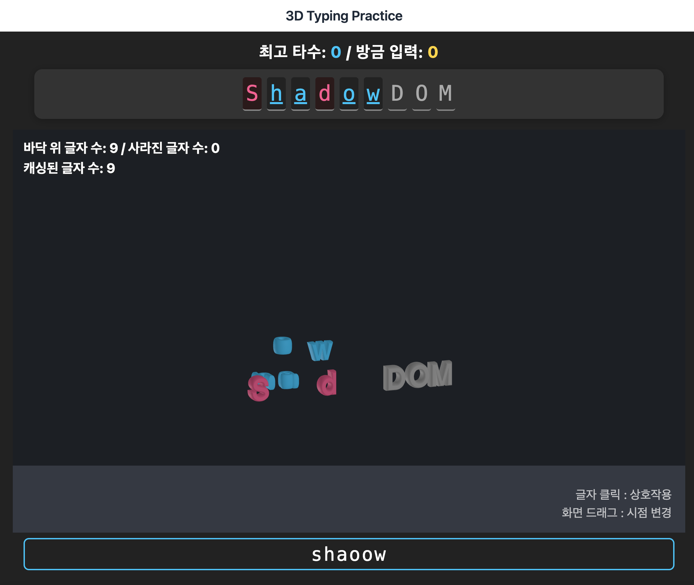
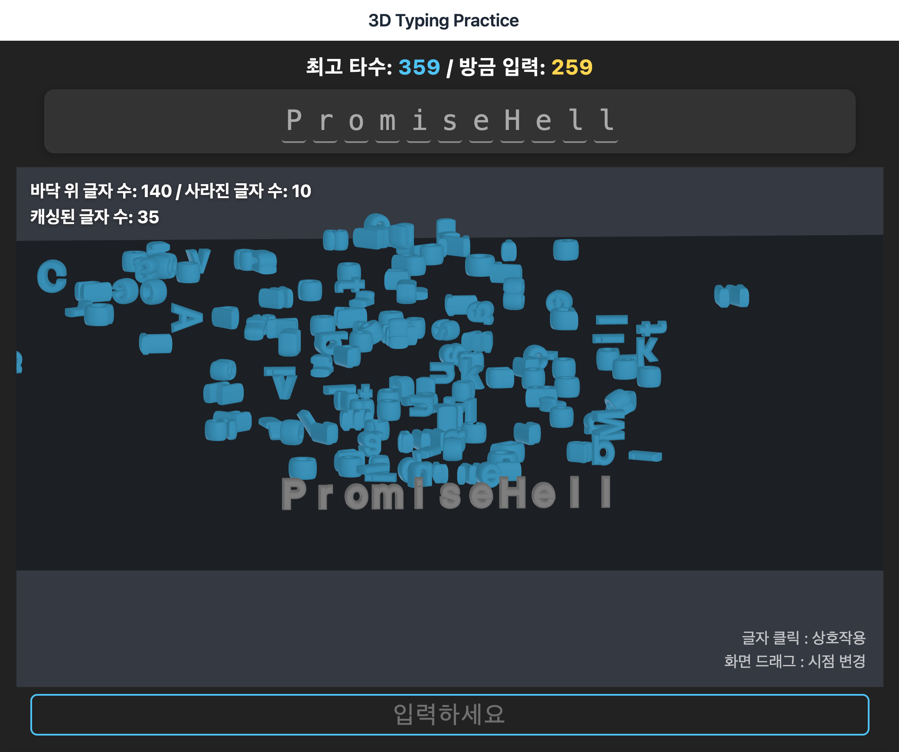

# Three JS + Cannon JS 를 이용한 인터랙티브 타자연습 게임

Three.js와 자바스크립트 물리엔진 라이브러리인 Cannon.JS를 이용하여 만든 타자연습 게임입니다.

작업일 : 2024.06.06~2024.06.10  
배포일 : 2025.07.10

배포 주소 : [https://three-js-typing.vercel.app/](https://three-js-typing.vercel.app/)

### 키를 누르세요.

키보드로 키를 입력할 때마다 틀린 글자는 빨간색, 맞춘 글자는 파란색으로 변합니다.  
파란색 글자가 되면 튕겨져 나갑니다.

### 더 많은 글자를 쌓으세요.

타자를 입력할 때마다 바닥에 더 많은 글자들이 쌓입니다.  
글자가 많아지면 바닥으로 떨어집니다.

쌓여가는 귀여운 글자들과 함께 타자연습을 즐기세요.
